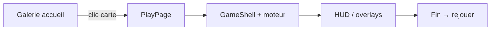

# Web playable game

Complément de **`graft-mini-games`** : la carte accueil = **teaser** (poster + preview hover) ; cette skill = **jeu jouable** sur `/play/<id>`.

**Lab canonique** : `projets/kikou` — Snake, Pong, Memory.

## Prérequis

1. Site avec `graft-mini-games` déjà greffé (ou en cours)
2. `react-router-dom` + route `/play/:gameId`
3. Lire `references/game-loop-patterns.md` avant tout code

## Flow gaming (couches)

| Couche | Skill | Emplacement |
|--------|-------|-------------|
| Teaser accueil | `graft-mini-games` | `src/mini-games/` |
| Jeu jouable | `web-playable-game` | `src/games/<id>/` |
| Layout play | cette skill | `src/pages/PlayPage.tsx` |
| Design system | cette skill | `src/index.css` + `gameTokens.ts` |



## Arborescence cible

```
src/games/
├── shared/
│   ├── GameShell.tsx       # stage, HUD, overlays, focus
│   ├── gameTokens.ts       # couleurs canvas SSOT
│   ├── TouchPads.tsx       # D-pad + vertical hold
│   └── useTouchControls.ts # détection mobile
├── snake/
│   └── SnakeGame.tsx
├── pong/
│   └── PongGame.tsx
└── memory/
    └── MemoryGame.tsx

src/pages/PlayPage.tsx        # registre GAMES + layout game-stage
```

Copier `references/shared/*` vers `src/games/shared/` (une fois par site).

## Workflow — ajouter un jeu jouable

### 1. Infrastructure (une fois par site)

1. Copier `references/shared/*` → `src/games/shared/`
2. Ajouter le bloc **Gaming design system** de `references/gaming-css.css` dans `src/index.css`
3. Créer ou enrichir `PlayPage.tsx` (voir `references/PlayPage.example.tsx`)
4. Enregistrer la route dans le router : `/play/:gameId`

### 2. Nouveau jeu

1. **Id** kebab-case aligné avec `mini-games/registry.ts` (`snake`, `pong`, `memory`, …)
2. Créer `src/games/<id>/<Id>Game.tsx`
3. Envelopper dans **`GameShell`** :
   - `hudLeft` / `hudCenter` / `hudRight` — score, coups, etc.
   - `ready` — instructions démarrage
   - `end` — game over / victoire + bouton rejouer
   - `touchControls` — si jeu directionnel (voir `TouchPads`)
4. **Boucle de jeu** — règles dans `game-loop-patterns.md` :
   - État mutable dans `useRef` (pas seulement `useState`)
   - `uiRef.current = ui` pour phases lues dans `setInterval` / `requestAnimationFrame`
   - `keydown` avec `{ capture: true }` sur `window`
   - `shellRef.current?.focus()` au mount et après reset
5. Couleurs canvas via `GAME` depuis `gameTokens.ts`
6. Entrée dans `PlayPage` `GAMES` record
7. Entrée `href: '/play/<id>'` dans `mini-games/registry.ts` (si pas déjà)
8. `npm run build`

### 3. Phases standard

| Phase | UX |
|-------|-----|
| `ready` | Overlay instructions, pas de simulation active |
| `playing` | Boucle active, contrôles réactifs |
| `over` / `won` | Overlay fin + rejouer (R ou bouton) |

Pong ajoute `serving` entre ready et playing.

### 4. Contrôles

| Plateforme | Pattern |
|------------|---------|
| Desktop | `window` keydown capture, focus sur `.game-shell` |
| Mobile | `useTouchControls()` + `TouchDirPad` ou `TouchVerticalPad` |
| Snake mobile | swipe sur le shell (`onShellPointerDown`) |

**Ne jamais** lancer la boucle uniquement depuis un `useEffect` qui dépend de `phase` — stale closure.

### 5. Patterns par type de jeu

| Type | Loop | Exemple |
|------|------|---------|
| Grille discrète | `setInterval` 100–160 ms | Snake |
| Physique continue | `requestAnimationFrame` + `dt` | Pong |
| UI / cartes | React state + `setTimeout` flip | Memory |

## Design system (non négociable)

- Stage : `.game-stage` sur `PlayPage`
- Shell : `.game-shell` — bordure, focus ring, `role="application"`
- HUD : `.game-hud` — texte muted, valeurs blanches
- Overlays : `.game-overlay--ready` / `--end`
- Boutons tactiles : `.game-touch-btn`

Tokens canvas : `gameTokens.ts` — ne pas hardcoder `#6366f1` dans chaque jeu.

## Qualité / tests manuels

- [ ] Clic carte accueil → `/play/<id>` (pas seulement preview hover)
- [ ] Clic zone jeu → focus → contrôles clavier OK
- [ ] Mobile : boutons tactiles ou swipe visibles et fonctionnels
- [ ] `prefers-reduced-motion` sur accueil (preview off) — jeu jouable inchangé
- [ ] Rejouer remet l'état initial
- [ ] `npm run build` sans régression

## Ne pas faire

- Jeu jouable dans la carte accueil (preview = démo seulement)
- `useState` seul pour positions lues dans une boucle async
- Oublier `href` dans registry → utilisateur bloqué sur preview « vidéo »
- Sons lourds ou assets multi-Mo sans demande

## Livrable par session

- Jeu(x) sous `src/games/<id>/`
- `PlayPage` + route
- Registry mini-games à jour
- Build OK
- Rappel : tester desktop + mobile

## Voir aussi

- `graft-mini-games` — poster + preview hover sur accueil
- `references/` — fichiers copiables depuis kikou